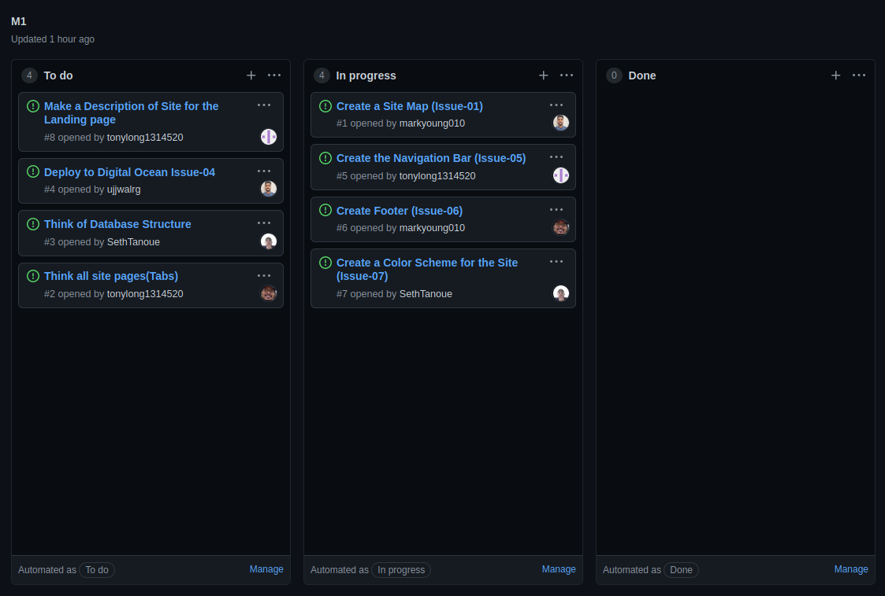

# Team Members

### Seth Tanoue

<b>hopes & dreams:</b> This will be my first time doing a coding project with multiple people. So figuring out the logistics of this project will be enlightening. Also, this project will be the first practical application of what we learned so far and I am curious on how much I have retained.

<b>background:</b> I have worked with databases like SQL and MongoDB as well as a few servers. I excel at menial tasks. If you give me a task list I will try to finish it as fast as possible.

### Tony Long
<b>hopes & dreams:</b> I want to practice building web pages and web applications, such as learning more about api’s.

<b>background:</b> Come from a pretty extensive Html/Css/Javascript background so I can bring my understanding and contribute anyway I can. Also I've worked on a few coding projects with others before so if there is one thing I know, its teamwork.

### Ujjwal Gautam
<b>hopes & dreams:</b> I'm looking forward to building a reactive web page from scratch. I want to level up my understanding of the client and server-side interactivity.

<b>background:</b> Intermediate level HTML/CSS/Javascript/React/Meteor background. I can bring a little bit of everything to the project.

### Mark Young
<b>hopes & dreams:</b> I’d like to learn about creating software as a team, and how to make a structure for completing a project.

<b>background:</b> I will work until the work is done. So I bring my dedication to the project.

# Coordination Strategy
<b>Meeting times:</b> Sunday 12 pm and Thursday 10:30 pm  
<b>Place:</b> discord

# Big Picture
<b><u>Problem:</u></b>  There is no dedicated reviews of classes for students attending UH Manoa. And during covid, users don't have any good ways to look at what events are coming up.  
<b><u>Solution:</u></b>  Our solution is to create a personalized review page made by fellow students with a seperate page that lets users post upcoming events.   
 
<ul>
  <li> Users are able to post events to the community event page without logging in. </li>
  <li> Visitors are able to view reviews without logging in. </li>
  <li> To post/edit reviews about classes, users will need to login. </li>
</ul>
  
<b> Users are able to post and edit reviews.  
 
  
<b> Users reviews are anonymous to protect users privacy.  

# Mockup
# M1 Project Board
